# 美容院管理系統 — 完整 Use Case 分析 vs 實作現況

> 對比來源：[美容院管理 App 功能規格書.md](美容院管理 App 功能規格書.md)
> 生成日期：2026-06-11

---

## 🎭 Use Case 總圖 (PlantUML)

```plantuml
@startuml 美容院管理系統-UseCase

title 美容院管理雲端系統 — Use Case 圖 v1.0

skinparam backgroundColor #FEFAF6
skinparam defaultFontName -apple-system, PingFang TC, sans-serif
skinparam roundCorner 12

left to right direction

' === Actors ===
actor "店長 (老闆)" as Owner
actor "一般員工 (美容師)" as Staff
actor "IT 管理員 (開發者)" as IT

' === Use Case Packages ===

package "🔐 認證與權限" as Auth {
  usecase "登入 / 登出" as UC_AUTH_01
  usecase "JWT 角色驗證 (shop_owner/staff)" as UC_AUTH_02
  usecase "店長設定員工角色" as UC_AUTH_03
}

package "👥 客戶管理" as Client {
  usecase "新增客戶" as UC_CLI_01
  usecase "編輯客戶資料" as UC_CLI_02
  usecase "搜尋客戶 (電話後四碼 / 姓名)" as UC_CLI_03
  usecase "設定客戶來源標籤" as UC_CLI_04
  usecase "標記特殊敏感客戶" as UC_CLI_05
  usecase "查看客戶詳情 (含備註)" as UC_CLI_06
  usecase "⚠️ 敏感客戶 Popup 警示" as UC_CLI_07
  usecase "客戶列表總覽" as UC_CLI_08
  usecase "🔴 刪除客戶 (僅店長)" as UC_CLI_09
}

package "💆 療程管理" as Treatment {
  usecase "建立療程項目 (名稱/分類/單價/套票次數)" as UC_TRT_01
  usecase "編輯療程" as UC_TRT_02
  usecase "停用療程" as UC_TRT_03
  usecase "查看療程列表" as UC_TRT_04
  usecase "客戶購買療程 (建立 client_services)" as UC_TRT_05
  usecase "手動贈送 / 新增次數 (僅店長)" as UC_TRT_06
  usecase "查看客戶療程庫存 (總次數/剩餘次數)" as UC_TRT_07
}

package "📅 預約管理 (三維防撞)" as Booking {
  usecase "建立預約 (客戶+療程+美容師+房間+儀器+時間)" as UC_BK_01
  usecase "修改預約" as UC_BK_02
  usecase "取消預約" as UC_BK_03
  usecase "預約改為「已出席」→ 觸發扣數" as UC_BK_04
  usecase "預約改為「失約」" as UC_BK_05
  usecase "查看今日預約總覽 (日曆 + 時間線)" as UC_BK_06
  usecase "🔴 三維防撞檢查 (美容師+房間+儀器)" as UC_BK_07
  usecase "⚠️ 失約 2 次自動警告" as UC_BK_08
  usecase "員工排班設定 (上班時間 / 休假)" as UC_BK_09
  usecase "非辦公時段自動隱藏" as UC_BK_10
}

package "✂️ 扣數與防呆" as Deduct {
  usecase "「已出席」自動彈出扣數確認單" as UC_DED_01
  usecase "手動勾選要扣減的療程項目" as UC_DED_02
  usecase "🔴 禁全自動盲目扣減 (員工必須手選)" as UC_DED_03
  usecase "一次勾選多個療程扣減" as UC_DED_04
  usecase "Transaction 原子扣數 + Log 寫入" as UC_DED_05
}

package "💰 每日結算" as Settlement {
  usecase "查看當日收入總覽" as UC_STL_01
  usecase "按支付方式分類顯示 (現金/信用卡/轉賬)" as UC_STL_02
  usecase "輸入備註 / 備用金差異" as UC_STL_03
  usecase "🔒 完成結算並鎖定 (二次確認)" as UC_STL_04
  usecase "查看交易明細" as UC_STL_05
}

package "🔄 退款與過期" as Refund {
  usecase "退款 (回補次數 / 退款金額)" as UC_REF_01
  usecase "套票過期處理 (清零剩餘次數)" as UC_REF_02
  usecase "填寫退款原因 (必填)" as UC_REF_03
  usecase "自動扣減當日收入" as UC_REF_04
  usecase "寫入不可刪改 Log" as UC_REF_05
}

package "📋 系統日誌 (防篡改)" as Log {
  usecase "自動記錄所有關鍵操作" as UC_LOG_01
  usecase "店長查看完整日誌" as UC_LOG_02
  usecase "員工查看自己的操作紀錄" as UC_LOG_03
  usecase "🛡️ INSERT-ONLY (禁止 UPDATE/DELETE)" as UC_LOG_04
}

package "😴 沉睡客管理" as Dormant {
  usecase "自動篩選 90 天無預約客戶" as UC_DOR_01
  usecase "查看沉睡天數" as UC_DOR_02
}

package "📤 資料匯出" as Export {
  usecase "一鍵匯出客戶名單 (Excel)" as UC_EXP_01
  usecase "一鍵匯出銷售紀錄 (Excel)" as UC_EXP_02
}

package "⚙️ 系統維護 (IT 管理員)" as Admin {
  usecase "Supabase Dashboard 直接管理" as UC_ADM_01
  usecase "資料備份與還原" as UC_ADM_02
  usecase "pg_cron 排程監控" as UC_ADM_03
  usecase "手動匯出資料庫" as UC_ADM_04
}

' === Relationships ===
Owner --> UC_AUTH_01
Owner --> UC_AUTH_03
Staff --> UC_AUTH_01
Staff --> UC_AUTH_02
Owner --> UC_AUTH_02

Owner --> UC_CLI_01
Owner --> UC_CLI_02
Owner --> UC_CLI_09
Staff --> UC_CLI_01
Staff --> UC_CLI_02
Owner --> UC_CLI_03
Staff --> UC_CLI_03
Owner --> UC_CLI_04
Owner --> UC_CLI_05
Owner --> UC_CLI_06
Staff --> UC_CLI_06
Owner --> UC_CLI_07
Staff --> UC_CLI_07
Owner --> UC_CLI_08
Staff --> UC_CLI_08

Owner --> UC_TRT_01
Owner --> UC_TRT_02
Owner --> UC_TRT_03
Owner --> UC_TRT_04
Staff --> UC_TRT_04
Owner --> UC_TRT_05
Owner --> UC_TRT_06
Owner --> UC_TRT_07
Staff --> UC_TRT_07

Owner --> UC_BK_01
Staff --> UC_BK_01
Owner --> UC_BK_02
Staff --> UC_BK_02
Owner --> UC_BK_03
Owner --> UC_BK_04
Staff --> UC_BK_04
Owner --> UC_BK_05
Staff --> UC_BK_05
Owner --> UC_BK_06
Staff --> UC_BK_06
Owner --> UC_BK_07
Staff --> UC_BK_07
Owner --> UC_BK_08
Staff --> UC_BK_08
Owner --> UC_BK_09
Owner --> UC_BK_10

Owner --> UC_DED_01
Staff --> UC_DED_01
Owner --> UC_DED_02
Staff --> UC_DED_02
Owner --> UC_DED_03
Staff --> UC_DED_03
Owner --> UC_DED_04
Staff --> UC_DED_04
Owner --> UC_DED_05
Staff --> UC_DED_05

Owner --> UC_STL_01
Staff --> UC_STL_01
Owner --> UC_STL_02
Owner --> UC_STL_03
Staff --> UC_STL_03
Owner --> UC_STL_04
Owner --> UC_STL_05
Staff --> UC_STL_05

Owner --> UC_REF_01
Owner --> UC_REF_02
Owner --> UC_REF_03
Owner --> UC_REF_04
Owner --> UC_REF_05

Owner --> UC_LOG_02
Staff --> UC_LOG_03

Owner --> UC_DOR_01
Owner --> UC_DOR_02

Owner --> UC_EXP_01
Owner --> UC_EXP_02

IT --> UC_ADM_01
IT --> UC_ADM_02
IT --> UC_ADM_03
IT --> UC_ADM_04

' === 關聯 ===
UC_BK_04 -[hidden]right-> UC_DED_01
UC_DED_01 ..> UC_DED_02 : <<include>>
UC_DED_02 ..> UC_DED_05 : <<include>>
UC_DED_05 ..> UC_LOG_01 : <<include>>

UC_BK_01 ..> UC_BK_07 : <<include>>
UC_BK_05 ..> UC_BK_08 : <<extend>>

UC_REF_01 ..> UC_REF_03 : <<include>>
UC_REF_01 ..> UC_REF_05 : <<include>>
UC_REF_01 ..> UC_LOG_01 : <<include>>

UC_STL_04 ..> UC_LOG_01 : <<include>>
UC_TRT_06 ..> UC_LOG_01 : <<include>>
UC_TRT_05 ..> UC_LOG_01 : <<include>>

@enduml
```

---

## 📊 功能完整度矩陣

### 🔐 認證與權限

| # | Use Case | 前端 | API/SQL | 狀態 |
|---|----------|------|---------|------|
| UC_AUTH_01 | 登入 / 登出 | ✅ LoginPage.jsx + AppLayout 登出 | ✅ Supabase Auth | ✅ 完成 |
| UC_AUTH_02 | JWT 角色驗證 | ✅ AuthContext.isOwner/isStaff | ✅ public.user_role() + RLS | ✅ 完成 |
| UC_AUTH_03 | 店長設定員工角色 | ❌ | ✅ set_claim_role() | 🔴 無管理介面 |

### 👥 客戶管理

| # | Use Case | 前端 | API/SQL | 狀態 |
|---|----------|------|---------|------|
| UC_CLI_01 | 新增客戶 | ❌ | ✅ INSERT RLS 開放 | 🔴 無頁面/表單 |
| UC_CLI_02 | 編輯客戶資料 | ❌ | ✅ UPDATE RLS 開放 | 🔴 只有按鈕無功能 |
| UC_CLI_03 | 搜尋客戶 (電話後四碼) | 🟡 NewAppointment 內嵌搜尋 | ✅ clients 表 | 🔴 無獨立搜尋頁 |
| UC_CLI_04 | 設定客戶來源標籤 | ❌ | ✅ clients.source | 🔴 無 UI |
| UC_CLI_05 | 標記特殊敏感客戶 | ❌ | ✅ clients.is_sensitive | 🔴 無 UI |
| UC_CLI_06 | 查看客戶詳情 | 🟡 ClientDetailPage 部分完成 | ✅ | 🟡 部分 |
| UC_CLI_07 | **敏感客戶 Popup 警示** | ❌ | ❌ | 🔴 完全未實作 |
| UC_CLI_08 | 客戶列表總覽 | 🔴 `
實作中
` placeholder | ✅ SELECT RLS | 🔴 空白頁 |
| UC_CLI_09 | 刪除客戶 (僅店長) | ❌ | ✅ DELETE RLS 僅店長 | 🔴 無 UI |

### 💆 療程管理

| # | Use Case | 前端 | API/SQL | 狀態 |
|---|----------|------|---------|------|
| UC_TRT_01 | 建立療程 | ✅ TreatmentManagePage Modal | ✅ INSERT RLS | ✅ 完成 |
| UC_TRT_02 | 編輯療程 | ✅ 同上 | ✅ UPDATE RLS | ✅ 完成 |
| UC_TRT_03 | 停用療程 | ✅ 附刪除確認 | ✅ soft-delete | ✅ 完成 |
| UC_TRT_04 | 查看療程列表 | ✅ | ✅ | ✅ 完成 |
| UC_TRT_05 | 客戶購買療程 | ❌ | ✅ client_services INSERT | 🔴 無 UI |
| UC_TRT_06 | 手動贈送次數 | 🟡 ClientDetail 有按鈕無功能 | ✅ manual_grant_sessions() | 🔴 功能未接 |
| UC_TRT_07 | 客戶療程庫存 | ✅ ClientDetailPage 顯示 | ✅ | ✅ 完成 |

### 📅 預約管理 (三維防撞)

| # | Use Case | 前端 | API/SQL | 狀態 |
|---|----------|------|---------|------|
| UC_BK_01 | 建立預約 | 🟡 NewAppointmentPage | ✅ appointments INSERT | 🟡 需實測 |
| UC_BK_02 | 修改預約 | ❌ | ❌ | 🔴 完全未實作 |
| UC_BK_03 | 取消預約 | ❌ | ❌ | 🔴 完全未實作 |
| UC_BK_04 | 改為「已出席」| ✅ DailyAppointmentsPage 點擊觸發 | ✅ deduct RPC | 🟡 需實測 |
| UC_BK_05 | 改為「失約」| ❌ | ❌ | 🔴 完全未實作 |
| UC_BK_06 | 今日預約總覽 | ✅ | ✅ appointments SELECT | ✅ 完成 |
| UC_BK_07 | 三維防撞檢查 | ✅ checkConflicts() | ✅ check_appointment_conflict() | ✅ 完成 |
| UC_BK_08 | **失約 2 次警告** | ❌ | 🟡 no_show_count 有計算 | 🔴 前端未顯示警告 |
| UC_BK_09 | 員工排班設定 | ❌ | ✅ staff_schedules 表 | 🔴 無管理介面 |
| UC_BK_10 | 非辦公時段隱藏 | ❌ | ❌ | 🔴 完全未實作 |

### ✂️ 扣數與防呆

| # | Use Case | 前端 | API/SQL | 狀態 |
|---|----------|------|---------|------|
| UC_DED_01 | 自動彈出扣數確認單 | ✅ handleStatusChange() | ✅ | 🟡 需實測 |
| UC_DED_02 | 手動勾選扣減項目 | ✅ DeductionModal | ✅ | 🟡 需實測 |
| UC_DED_03 | 禁全自動盲目扣減 | ✅ 多選 Checkbox | ✅ RPC 強制檢查 | ✅ 完成 |
| UC_DED_04 | 一次勾選多個 | ✅ Checkbox 多選 | ✅ p_service_ids[] | ✅ 完成 |
| UC_DED_05 | Transaction 原子扣數 | ✅ | ✅ deduct_service_from_appointment | ✅ 完成 |

### 💰 每日結算

| # | Use Case | 前端 | API/SQL | 狀態 |
|---|----------|------|---------|------|
| UC_STL_01 | 當日收入總覽 | ✅ DailySettlementPage | ✅ | 🟡 需實測 |
| UC_STL_02 | 支付方式分類 | ✅ 現金/信用卡/轉賬卡片 | ✅ | 🟡 需實測 |
| UC_STL_03 | 備註差異輸入 | ✅ Textarea | ✅ | 🟡 需實測 |
| UC_STL_04 | 鎖定結算二次確認 | ✅ 二次確認 Modal | ✅ close_daily_settlement() | 🟡 需實測 |
| UC_STL_05 | 交易明細 | ✅ Table | ✅ | 🟡 需實測 |

### 🔄 退款與過期

| # | Use Case | 前端 | API/SQL | 狀態 |
|---|----------|------|---------|------|
| UC_REF_01 | 退款 (回補次數) | ❌ | ✅ refund_deduction() | 🔴 無退款頁面 |
| UC_REF_02 | 套票過期處理 | ❌ | ❌ | 🔴 完全未實作 |
| UC_REF_03 | 退款原因必填 | ❌ | ✅ reason NOT NULL | 🔴 無 UI |
| UC_REF_04 | 自動扣減當日收入 | ❌ | ✅ | 🔴 無 UI |
| UC_REF_05 | 不可刪改 Log | ❌ | ✅ INSERT-ONLY | 🔴 無 UI |

### 📋 系統日誌

| # | Use Case | 前端 | API/SQL | 狀態 |
|---|----------|------|---------|------|
| UC_LOG_01 | 自動記錄關鍵操作 | ❌ | ✅ RPC 內自動寫入 | ✅ 完成 |
| UC_LOG_02 | 店長查看日誌 | 🟡 ActivityLogPage | ✅ | 🟡 需實測 |
| UC_LOG_03 | 員工看自己紀錄 | 🟡 同上 | ✅ RLS 過濾 | 🟡 需實測 |
| UC_LOG_04 | INSERT-ONLY | ❌ | ✅ RLS USING(false) | ✅ 完成 |

### 😴 沉睡客

| # | Use Case | 前端 | API/SQL | 狀態 |
|---|----------|------|---------|------|
| UC_DOR_01 | 90天無預約篩選 | 🟡 DormantClientsPage | ✅ dormant_clients View | 🟡 需實測 |

### 📤 資料匯出

| # | Use Case | 前端 | API/SQL | 狀態 |
|---|----------|------|---------|------|
| UC_EXP_01 | 匯出客戶名單 Excel | ❌ | ✅ (前端 library 已安裝) | 🔴 無按鈕 |
| UC_EXP_02 | 匯出銷售紀錄 Excel | ❌ | ✅ (前端 library 已安裝) | 🔴 無按鈕 |

### ⚙️ 系統維護

| # | Use Case | 前端 | API/SQL | 狀態 |
|---|----------|------|---------|------|
| UC_ADM_01 | Supabase Dashboard | ❌ | ✅ | N/A |
| UC_ADM_02 | 資料備份 | ❌ | 🟡 手動 pg_dump | N/A |
| UC_ADM_03 | pg_cron 排程 | ❌ | ✅ heartbeat + cleanup | ✅ 完成 |
| UC_ADM_04 | 手動匯出 | ❌ | ✅ Dashboard 功能 | N/A |

---

## 📈 統計

| 狀態 | 數量 | 說明 |
|------|------|------|
| ✅ 完成 | 18 | 登入、療程 CRUD、預約總覽、三維防撞等 |
| 🟡 部分/需實測 | 14 | 扣數流程、結算、ClientDetail、日誌等 |
| 🔴 完全未實作 | 18 | 客戶列表頁、敏感 Popup、退款、失約警告、排班、Excel 匯出等 |

---

## 🔴 高優先度遺漏 (影響核心流程)

1. **客戶列表頁 (UC_CLI_08)** — 現在是空白 placeholder，員工無法搜尋/瀏覽客戶
2. **敏感客戶 Popup (UC_CLI_07)** — 規格書明確要求，完全沒做
3. **失約 2 次警告 (UC_BK_08)** — 規格書要求，資料庫已有 `no_show_count` 但前端沒顯示
4. **退款介面 (UC_REF_01~05)** — 店長的核心權限功能，完全沒做
5. **客戶購買療程 (UC_TRT_05)** — 沒有 UI 可以幫客戶新增療程庫存
6. **員工排班 (UC_BK_09)** — 表有建但無管理頁面
7. **Excel 匯出 (UC_EXP_01~02)** — 規格書要求，xlsx 已安裝但沒接上
8. **預約修改/取消 (UC_BK_02~03)** — 預約卡片有「詳情」按鈕但沒功能
9. **非辦公時段隱藏 (UC_BK_10)** — 跟排班連動
10. **客戶來源標籤/敏感標記 (UC_CLI_04~05)** — 新增/編輯客戶時沒有這些欄位

---

## 👣 建議實作順序

| 優先 | Use Case | 理由 |
|------|---------|------|
| P0 | UC_CLI_08 客戶列表頁 | 最基本 CRUD 頁面缺失 |
| P0 | UC_CLI_07 敏感 Popup | 規格書要求，影響客戶安全 |
| P1 | UC_REF_01~05 退款 | 店長核心權限 |
| P1 | UC_TRT_05 客戶購買療程 | 沒有這 UI 就無法建庫存 |
| P1 | UC_BK_08 失約警告 | 規格書要求 |
| P2 | UC_BK_09 排班設定 | 影響預約可用時段 |
| P2 | UC_EXP_01~02 Excel 匯出 | 規格書要求 |
| P2 | UC_BK_02~03 修改/取消預約 | 基本操作 |
