# 美容院管理系統 — 時序圖、狀態機與活動圖

> 配合 [完整 Use Case 分析與實作現況.md](完整 Use Case 分析與實作現況.md)
> 生成日期：2026-06-11

---

## 目錄

1. [時序圖 Sequence Diagrams](#1-時序圖)
   - 1.1 登入流程
   - 1.2 建立預約 (三維防撞)
   - 1.3 預約 → 已出席 → 扣數 (核心防呆)
   - 1.4 退款流程
   - 1.5 每日結算鎖定
2. [狀態機圖 State Machine Diagrams](#2-狀態機圖)
   - 2.1 預約狀態機
   - 2.2 每日結算狀態機
   - 2.3 client_services 狀態機
3. [活動圖 Activity Diagrams](#3-活動圖)
   - 3.1 扣數完整活動
   - 3.2 建立預約活動 (含三維防撞)
   - 3.3 退款活動
   - 3.4 每日結算活動

---

## 1. 時序圖 (Sequence Diagrams)

### 1.1 登入流程

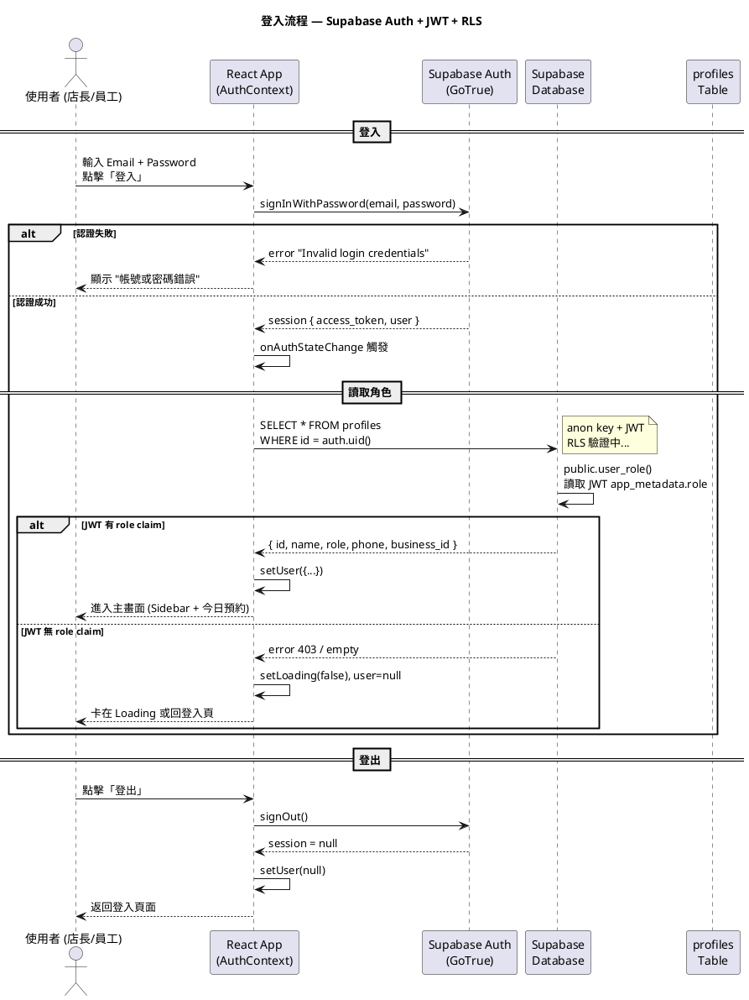

---

### 1.2 建立預約 (三維防撞)

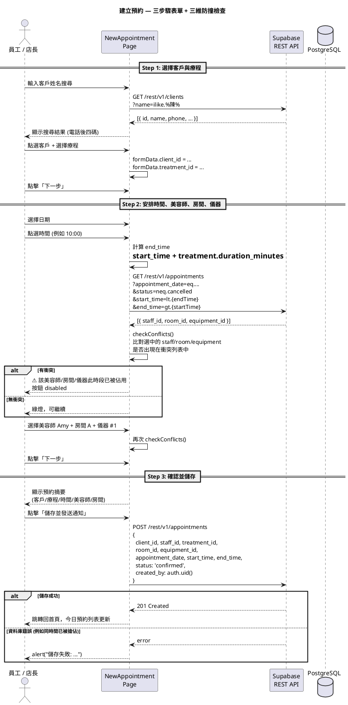

---

### 1.3 預約 → 已出席 → 扣數 (核心防呆)

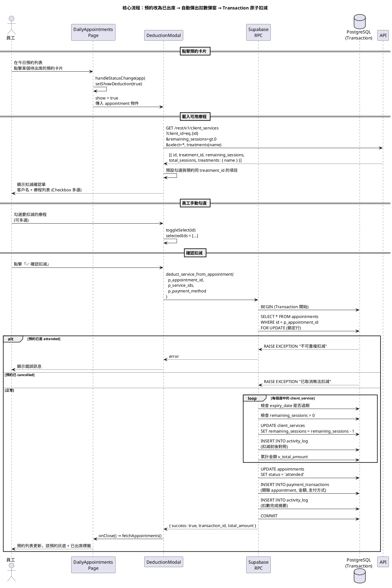

---

### 1.4 退款流程

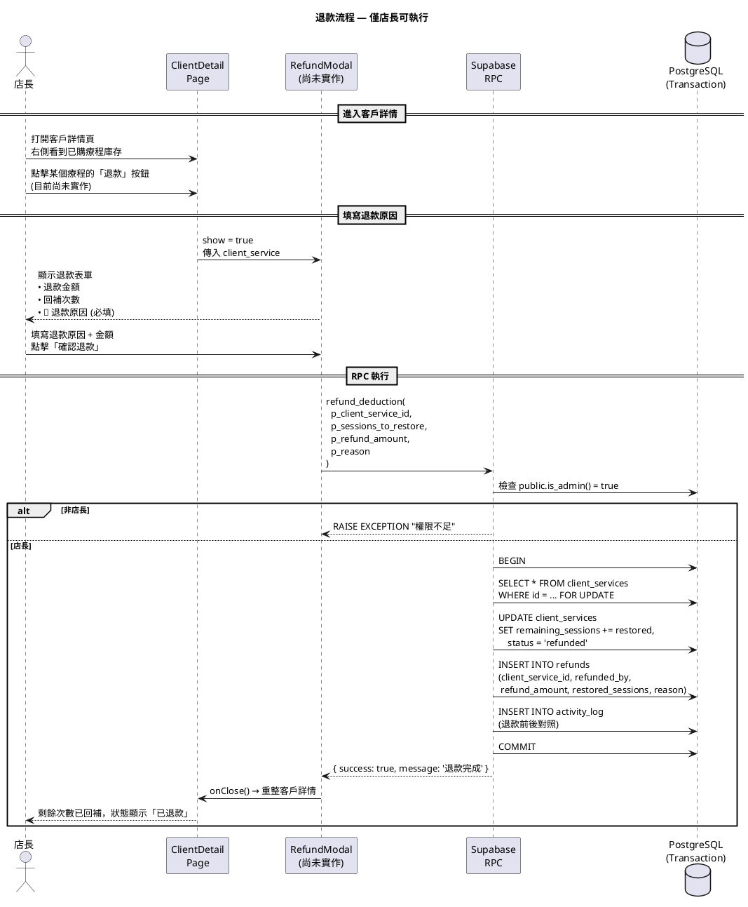

---

### 1.5 每日結算鎖定

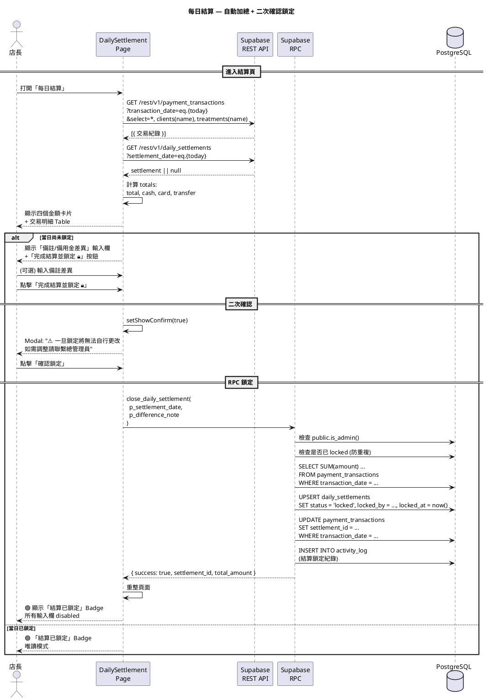

---

### 1.6 店長退回已出席預約 (扣數撤銷)

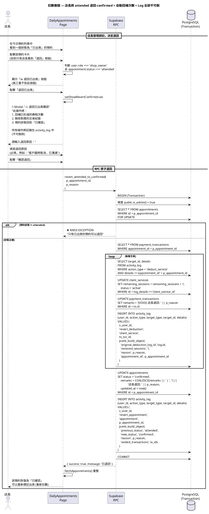

---

### 1.7 退回後的重新扣數 (邊緣案例)

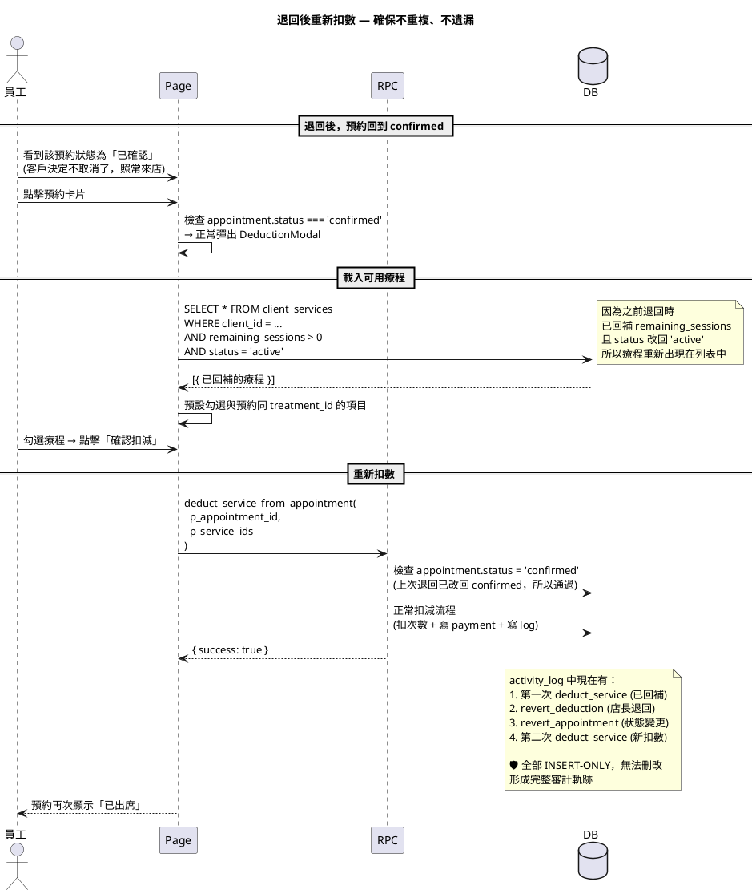

---

## 2. 狀態機圖 (State Machine Diagrams) — 修訂版

### 2.1 預約狀態機 (Appointment) — 含退回路徑

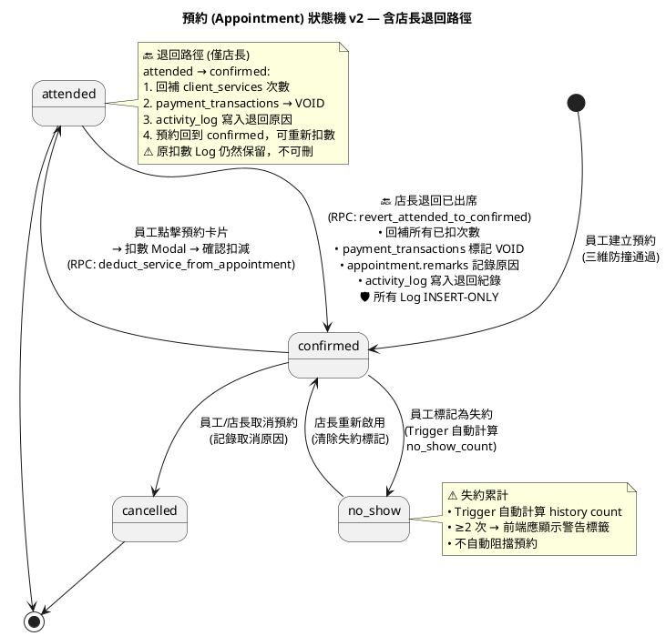

---

### 2.2 client_services 狀態機 — 含退回路徑

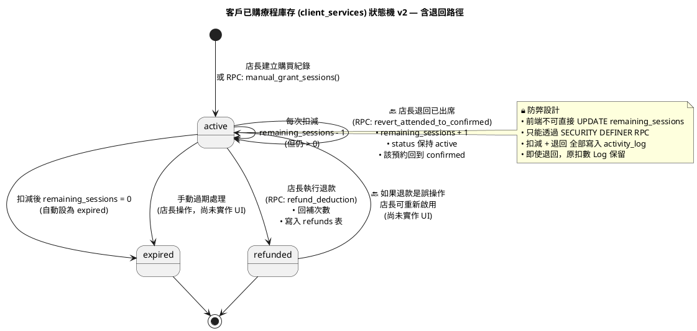

---

## 3. 活動圖 (Activity Diagrams) — 修訂版

### 3.1 退回已出席活動圖 (新增)

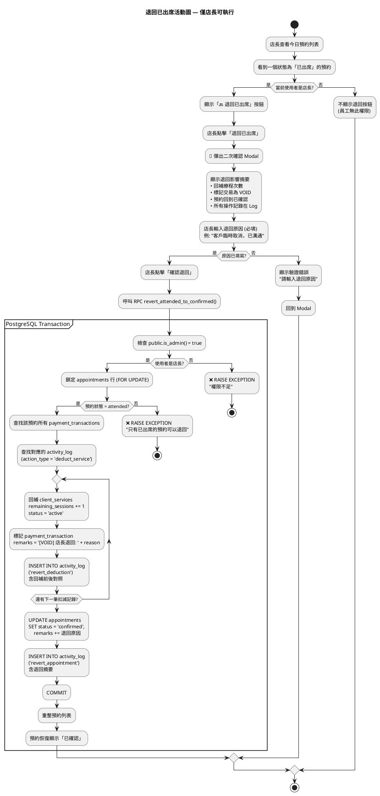

---

### 3.2 扣數活動圖 (修訂版 — 含退回後重新扣數)

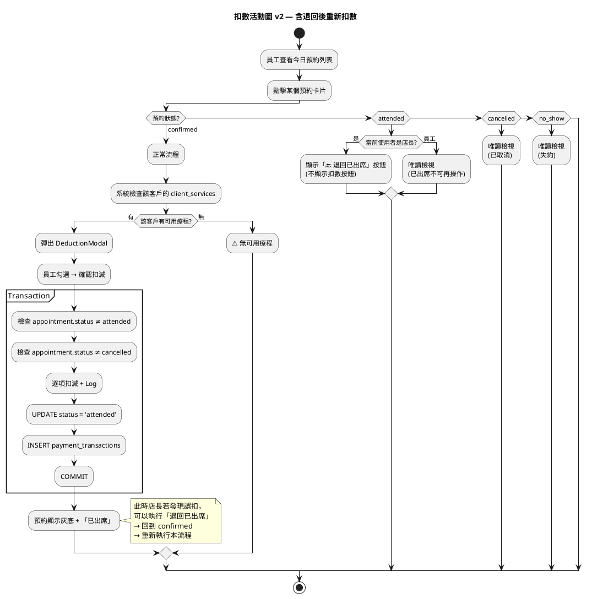

---

## 4. 邊緣案例完整矩陣

### 4.1 扣數相關邊緣案例

| # | 場景 | 處理方式 | 狀態 |
|---|------|---------|------|
| E1 | 扣數後客戶取消 → 店長退回 | RPC `revert_attended_to_confirmed` (新增) | 🔴 需新增 SQL + 前端 |
| E2 | 退回後客戶又決定要來 → 重新扣數 | 預約回到 confirmed，正常走 DeductionModal | ✅ 設計完成 |
| E3 | 退回後客戶永久取消 → 直接 cancel | 店長手動改狀態為 cancelled（不扣數） | 🟡 前端缺取消 UI |
| E4 | 員工誤扣 → 店長不在 → 先掛著 | 只能等店長回來處理（設計意圖） | ✅ 符合需求 |
| E5 | 同一預約重複點擊扣數 | RPC 檢查 status='attended' → 拒絕 | ✅ SQL 已有 |
| E6 | 已取消的預約嘗試扣數 | RPC 檢查 status='cancelled' → 拒絕 | ✅ SQL 已有 |
| E7 | 扣數時療程剛好過期 | RPC 檢查 expiry_date < CURRENT_DATE → 拒絕 | ✅ SQL 已有 |
| E8 | 扣數時庫存不足 (remaining=0) | WHERE remaining_sessions > 0 過濾 → 不顯示 | ✅ 前端+SQL 已有 |
| E9 | 退回後再退回 (重複退回) | RPC 檢查 status='attended' → 退回後已是 confirmed → 拒絕 | ✅ SQL 邏輯防止 |
| E10 | 退回時 payment_transactions 已被結算鎖定 | 照退不誤。payment 標記 VOID，結算金額不變。店長看 VOID 標記自行知道有差異 | ✅ 決定：記錄為主 |

### 4.2 結算相關邊緣案例

| # | 場景 | 處理方式 | 狀態 |
|---|------|---------|------|
| E11 | 退回已出席發生在當日結算鎖定之後 | 同上，照退。記錄清楚即可，不需 T 字帳 | ✅ 決定：記錄為主 |
| E12 | 結算鎖定後有新交易 (例如隔日補登) | 鎖定只針對當日 transaction_date | ✅ 設計正確 |
| E13 | 跨日退回 (昨天已結算，今天才發現誤扣) | 照退，無時間限制。activity_log 完整記錄即可 | ✅ 決定：記錄為主 |

### 4.3 權限相關邊緣案例

| # | 場景 | 處理方式 | 狀態 |
|---|------|---------|------|
| E14 | 員工嘗試直接 UPDATE client_services | RLS 沒有 UPDATE policy → 403 | ✅ 已完成 |
| E15 | 店長嘗試 DELETE activity_log | RLS 沒有 DELETE policy → 403 | ✅ 已完成 |
| E16 | 員工嘗試執行退款 RPC | RPC 內部檢查 is_admin() → 拒絕 | ✅ 已完成 |
| E17 | 員工嘗試退回已出席 | 前端隱藏按鈕 + RPC 檢查 is_admin() | 🟡 RPC 需新增 |

---

## 5. 需要新增的 SQL：revert_attended_to_confirmed RPC

```sql
-- ============================================================
-- 8.6 revert_attended_to_confirmed() — 🔙 店長退回已出席
--     將 attended 退回 confirmed，自動回補所有已扣次數
--     • payment_transactions 標記 VOID (不刪除)
--     • client_services 回補次數
--     • activity_log 寫入完整退回紀錄
--     • 所有操作在單一 Transaction 中完成
-- ============================================================
CREATE OR REPLACE FUNCTION revert_attended_to_confirmed(
  p_appointment_id UUID,
  p_reason         TEXT
)
RETURNS JSONB AS $$
DECLARE
  v_user_id     UUID;
  v_appt            public.appointments%ROWTYPE;
  v_log         RECORD;
  v_restored    INT := 0;
  v_tx_ids      UUID[] := '{}';
BEGIN
  v_user_id := auth.uid();

  -- 🔴 權限檢查：僅店長
  IF NOT public.is_admin() THEN
    RAISE EXCEPTION '權限不足：只有店長可以退回已出席的預約';
  END IF;

  -- 鎖定預約行
  SELECT * INTO v_appt
  FROM public.appointments
  WHERE id = p_appointment_id
  FOR UPDATE;

  IF NOT FOUND THEN
    RAISE EXCEPTION '找不到預約紀錄';
  END IF;

  -- 🔴 只有 attended 可以退回
  IF v_appt.status != 'attended' THEN
    RAISE EXCEPTION '只有已出席的預約可以退回，目前狀態：%', v_appt.status;
  END IF;

  -- 收集所有由此次預約產生的 payment_transactions
  FOR v_log IN
    SELECT al.target_id AS client_service_id,
           (al.details->>'after_remaining')::INT AS after_remaining,
           (al.details->>'before_remaining')::INT AS before_remaining
    FROM public.activity_log al
    WHERE al.action_type = 'deduct_service'
      AND al.details->>'appointment_id' = p_appointment_id::TEXT
  LOOP
    -- 回補 client_services 次數
    UPDATE public.client_services
    SET remaining_sessions = remaining_sessions + 1,
        status = 'active'
    WHERE id = v_log.client_service_id;

    IF FOUND THEN
      v_restored := v_restored + 1;

      -- 寫入退回明細 Log
      INSERT INTO public.activity_log (user_id, action_type, target_type, target_id, details)
      VALUES (
        v_user_id,
        'revert_deduction',
        'client_service',
        v_log.client_service_id,
        jsonb_build_object(
          'appointment_id', p_appointment_id,
          'restored_sessions', 1,
          'before_remaining', COALESCE(v_log.after_remaining, 0),
          'after_remaining', COALESCE(v_log.after_remaining, 0) + 1,
          'reason', p_reason
        )
      );
    END IF;
  END LOOP;

  -- 標記所有關聯的 payment_transactions 為 VOID
  WITH updated AS (
    UPDATE public.payment_transactions
    SET remarks = COALESCE(remarks || ' | ', '') || '[VOID] 店長退回: ' || p_reason
    WHERE appointment_id = p_appointment_id
    RETURNING id
  )
  SELECT array_agg(id) INTO v_tx_ids FROM updated;

  -- 更新預約狀態回 confirmed
  UPDATE public.appointments
  SET status = 'confirmed',
      remarks = COALESCE(remarks || ' | ', '') || '🔙 店長退回(' || now()::DATE::TEXT || '): ' || p_reason,
      updated_at = now()
  WHERE id = p_appointment_id;

  -- 寫入退回摘要 Log
  INSERT INTO public.activity_log (user_id, action_type, target_type, target_id, details)
  VALUES (
    v_user_id,
    'revert_appointment',
    'appointment',
    p_appointment_id,
    jsonb_build_object(
      'previous_status', 'attended',
      'new_status', 'confirmed',
      'reason', p_reason,
      'restored_services_count', v_restored,
      'voided_transaction_ids', v_tx_ids
    )
  );

  RETURN jsonb_build_object(
    'success', true,
    'restored_count', v_restored,
    'voided_transactions', v_tx_ids,
    'message', '已退回 ' || v_restored || ' 筆療程扣減，預約回到「已確認」'
  );

EXCEPTION WHEN OTHERS THEN
  RAISE;
END;
$$ LANGUAGE plpgsql SECURITY DEFINER SET search_path = '';
```

---

## 6. 商業規則總結

| 規則 | 說明 |
|------|------|
| **誰能扣數** | 任何已登入使用者 (員工 + 店長) |
| **誰能退回** | 只有店長 (`shop_owner`) |
| **退回條件** | 預約必須是 `attended` 狀態 |
| **退回後果** | 次數回補、交易標記 VOID、預約回到 confirmed、可重新扣數 |
| **Log 保留** | 所有操作 (扣數 + 退回 + 重新扣數) 全部 INSERT-ONLY，不可刪 |
| **重複退回防範** | 退回後 status 變 confirmed → 再次呼叫 RPC 會因 status != attended 被拒絕 |
| **退回原因** | 必填，寫入 appointment.remarks + activity_log.details |
| **結算衝突** | payment_transactions 標記 VOID 而非刪除 → 已鎖定結算會出現差異 (需手動標示) |

  • (目前無解鎖機制，需手動 SQL)
end note

locked --> [*]
@enduml
```

---

### 2.3 client_services 狀態機 (客戶療程庫存)

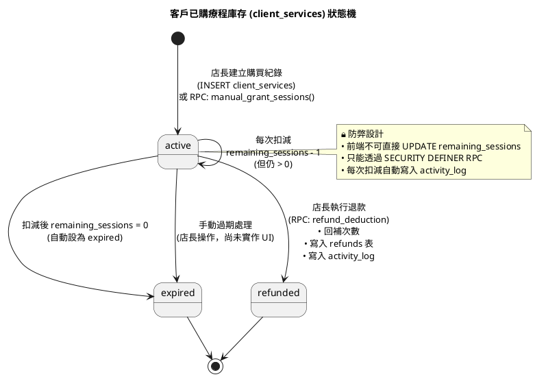

---

## 3. 活動圖 (Activity Diagrams)

### 3.1 扣數完整活動圖

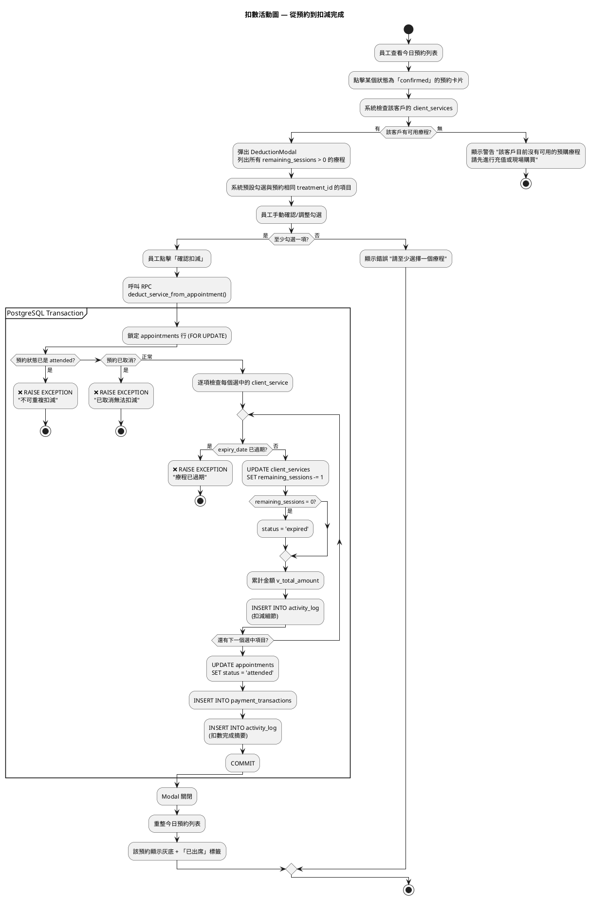

---

### 3.2 建立預約活動圖 (含三維防撞)

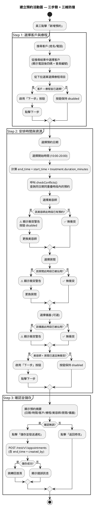

---

### 3.3 退款活動圖

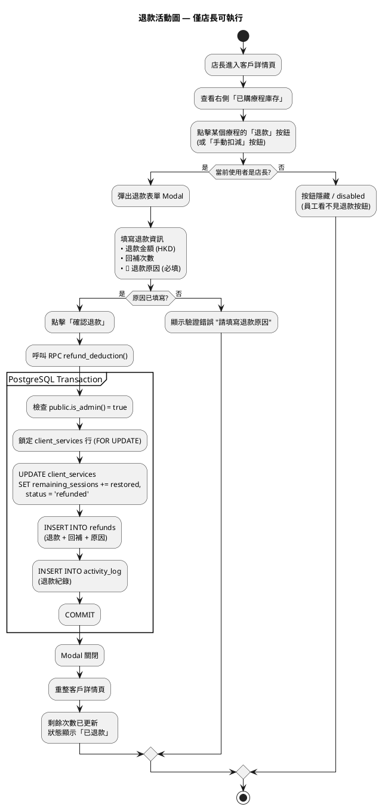

---

### 3.4 每日結算活動圖

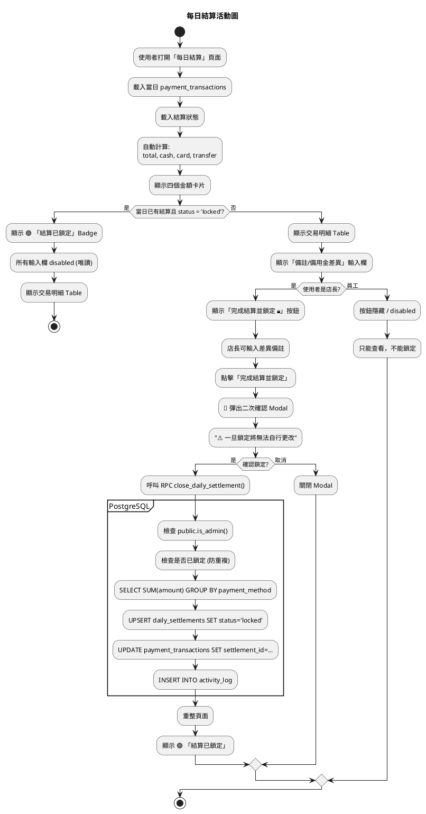

---

## 📋 圖表清單

| 類型 | 圖表 | 涵蓋 Use Case |
|------|------|--------------|
| 時序圖 | 1.1 登入流程 | UC_AUTH_01~02 |
| 時序圖 | 1.2 建立預約 (三維防撞) | UC_BK_01, UC_BK_07 |
| 時序圖 | 1.3 預約→出席→扣數 | UC_BK_04, UC_DED_01~05 |
| 時序圖 | 1.4 退款流程 | UC_REF_01~05 |
| 時序圖 | 1.5 每日結算鎖定 | UC_STL_01~04 |
| 狀態機 | 2.1 預約狀態機 | UC_BK_01~05 |
| 狀態機 | 2.2 結算狀態機 | UC_STL_04 |
| 狀態機 | 2.3 client_services 狀態機 | UC_TRT_05, UC_REF_01 |
| 活動圖 | 3.1 扣數完整活動 | UC_DED_01~05 |
| 活動圖 | 3.2 建立預約活動 | UC_BK_01~07 |
| 活動圖 | 3.3 退款活動 | UC_REF_01~05 |
| 活動圖 | 3.4 每日結算活動 | UC_STL_01~04 |
