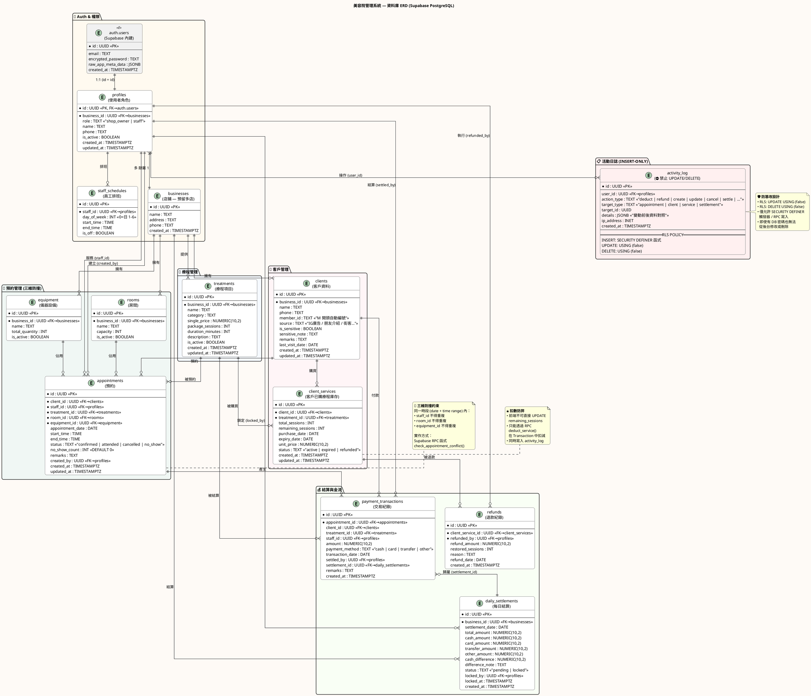

# 美容院管理系統 — 資料庫 ERD

> 可直接複製下方 PlantUML 程式碼到 [PlantUML Online](https://www.plantuml.com/plantuml/uml/) 或支援 PlantUML 的編輯器（VS Code + PlantUML 擴充）中即時預覽。

---

## 📊 快速總覽

### 12 張核心資料表

| 模組 | 表名 | 用途 |
|------|------|------|
| 🔐 Auth | `auth.users` | Supabase 內建認證 |
| 🔐 Auth | `profiles` | 使用者角色 (shop_owner / staff) |
| 🔐 Auth | `staff_schedules` | 員工排班 |
| 🔐 Auth | `businesses` | 店鋪（預留多店） |
| 👥 客戶 | `clients` | 客戶資料 + 標籤 + 來源 |
| 👥 客戶 | `client_services` | 客戶已購療程庫存（剩餘次數） |
| 💆 療程 | `treatments` | 療程項目 + 單價 |
| 📅 預約 | `rooms` | 房間 |
| 📅 預約 | `equipment` | 儀器設備 |
| 📅 預約 | `appointments` | 預約核心（三維防撞） |
| 💰 金流 | `payment_transactions` | 交易紀錄 |
| 💰 金流 | `daily_settlements` | 每日結算（可鎖定） |
| 💰 金流 | `refunds` | 退款紀錄 |
| 📋 日誌 | `activity_log` | **INSERT-ONLY** 活動日誌 |

### 🔴 三大安全機制

1. **三維防撞** — 同一時段 staff + room + equipment 不得衝突
2. **防篡改 Log** — RLS `UPDATE USING (false)` `DELETE USING (false)`
3. **扣數防弊** — 前端不可直接 UPDATE `remaining_sessions`，只能透過 SECURITY DEFINER RPC
